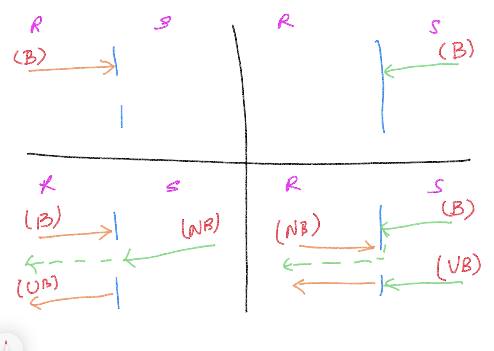

# Magesh Kuppan

## Software Requirements
- Go Tools (https://go.dev/dl)
- Visual Studio Code (https://code.visualstudio.com)
- Docker

## Schedule:
    Commence    : 9:30 AM
    Tea Break   : 11:00 AM (15 mins)
    Lunch Break : 1:00 PM (1 hour)
    Tea Break   : 3:30 PM (15 mins)
    Wind up     : 5:30 PM

## Methodology
- No powerpoint
- Discussion & Code

## Repository
- https://github.com/tkmagesh/bakerhughes-advgo-oct-2023 (https://bit.ly/bh-ago)

## Go
- Functional Programming
- Interfaces
- Struct Composition
- Concurrency

## Functional Programming
- Assign a function as a value to a variable
- Higher Order Functions
    - Pass functions as arguments to other functions
    - Return functions as return values

## Concurrency in Go
### Concurrency
- The ability to have more than one execution path in the application
### Race Detection
    - go run --race <filename.go>
    - go build --race <filename.go> 
        - DO NOT use a build with race detector in production
### Channel
- data type to enable communication between goroutines
- declare
```
var <var_name> chan <data_type>
ex : var ch chan int
```
- initialize
```
<var_name> = make(chan <data_type>)
ex: ch = make(chan int)
```
- declare & initalize
```
ch := make(chan int)
```
- Channel Operation
    - Using the channel operator ( <- )
    - Send operation
    ```
        ch <- 100
    ```
    - Receive Operation
    ```
        data := <- ch
    ```
- Channel Behaviors
    - Receive Operation
        - A RECEIVE operation is ALWAYS a blocking operation
    - Send Operation
        - A SEND operation is blocked until a RECEIVE operation is initiated


- Closed channel
    - Attempt to perform a "receive" operation on a "closed" channel will return the default value of the channel data type

# GRPC #
## GRPC? ##
    - binary serialization
    - smaller payload size when compared to XML & JSON
    - communication patterns
        - request / response pattern
        - client streaming (many requests & one response)
        - server streaming (one request & many responses)
        - bidirectional streaming (many requests & many responses)
    - support for limited number of languages
    - share the service & payload schema beforehand

## Steps: ##
    - Create service / operations / data contracts using protocol buffers
    - Share the contract between the client & server
    - Generate proxy & stub using the contracts
    - Server
        - implement the service (with the business logic) based on the contract
        - host the service
    - Client
        - Use the proxy to communicate to the service


## Tools Installation ##
    1. Protocol Buffers Compiler (protoc tool)
        Windows:
            Download the file, extract and keep in a folder (PATH) accessble through the command line
            https://github.com/protocolbuffers/protobuf/releases/download/v21.12/protoc-21.12-win64.zip
        Mac:
            brew install protobuf

        Verification:
            protoc --version

    2. Go plugins (installed in the GOPATH/bin folder)
        go install google.golang.org/protobuf/cmd/protoc-gen-go@v1.28
        go install google.golang.org/grpc/cmd/protoc-gen-go-grpc@v1.2

## App Setup
```
/grpc-app
    /client
    /server
    /proto
```

## To generate the proxy & stub (run the following command from the grpc-app folder)
```
protoc --go_out=. --go_opt=paths=source_relative --go-grpc_out=. --go-grpc_opt=paths=source_relative proto/service.proto
```